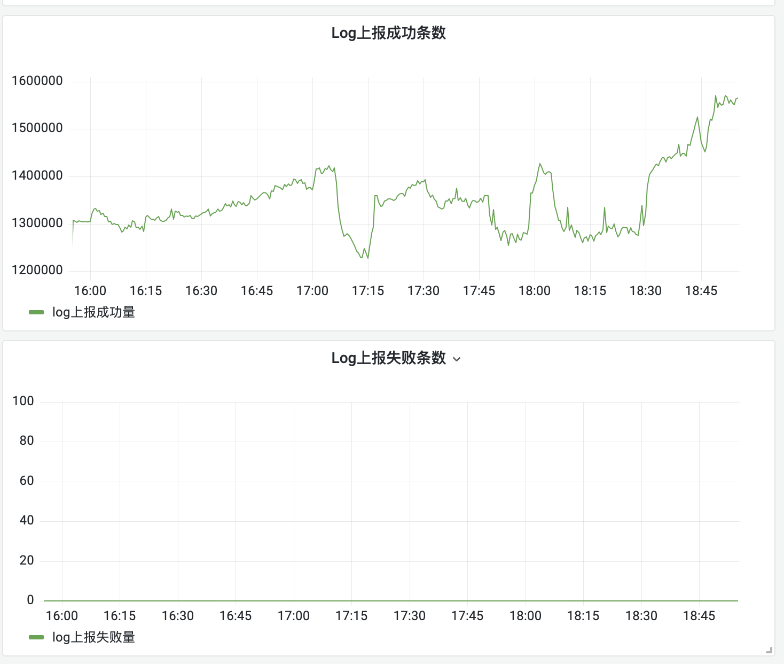

demo：使用asyncexporter上报日志

```go
import 	"trpc.group/trpc-go/trpc-opentelemetry/exporter/asyncexporter"
func main() {
	//一定要在trpc.NewServer()以前使用
	asyncexporter.Concurrency = 4
	asyncexporter.QueueSize = 5120
    s := trpc.NewServer()
    pb.RegisterGreeterServer(s, &GreeterServerImpl{})
    log.Fatal(s.Serve())
}
```


log上报成功
sum(increase(opentelemetry_sdk_batch_process_counter{app=~"$app", server=~"$server",namespace=~"$namespace", env_name=~"$env_name",status="async_success",telemetry="logs"}[1m]))
or
sum(increase(opentelemetry_sdk_batch_process_counter{app=~"$app", server=~"$server",namespace=~"$namespace", env_name=~"$env_name",status="async_success",telemetry="logs"}[1m]))


log上报失败条数
sum(increase(opentelemetry_sdk_batch_process_counter{app=~"$app", server=~"$server",namespace=~"$namespace", env_name=~"$env_name",status="async_failed",telemetry="logs"}[1m]))
or
sum(increase(opentelemetry_sdk_batch_process_counter{app=~"$app", server=~"$server",namespace=~"$namespace", env_name=~"$env_name",status="async_failed",telemetry="logs"}[1m]))

即把原有查询语句中status标签的值加上async前缀